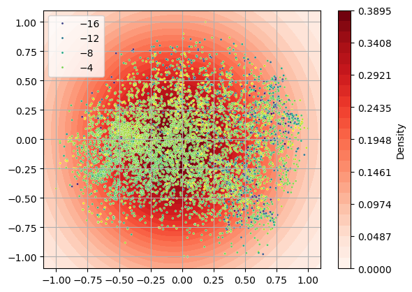
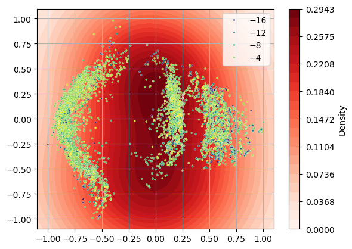
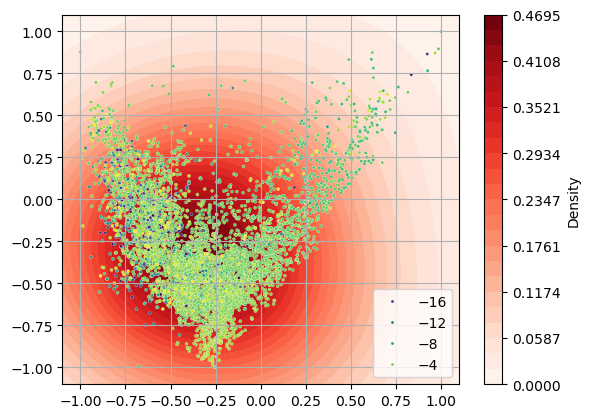

* Visualisations for graph learning project

** Functions
#+BEGIN_SRC jupyter-python :session py
import pandas as pd
import numpy as np

from sklearn.neighbors import KernelDensity
from sklearn.manifold import Isomap
from sklearn.preprocessing import MinMaxScaler

import matplotlib.pyplot as plt
import seaborn as sns
%matplotlib inline

def load_data(npz):
    data = np.load(npz)
    embeddings, labels = data["embeddings"], data["labels"]

    print(f"loaded embeddings with dimensions: {embeddings.shape}\n and labels with dimensions: {labels.shape}")
    
    return embeddings, labels

def decomp_embedding(embeddings, dim=2):
    decomper = Isomap(n_components=dim, n_neighbors=50, n_jobs=-1)
    scaler = MinMaxScaler((-1,1))

    X_decomp = scaler.fit_transform(decomper.fit_transform(embeddings))
    return X_decomp

def plot_decomp_kde(X_decomp, ax, labels=None, colorbar=False):
    kde = KernelDensity(kernel="gaussian", bandwidth=0.5)
    kde.fit(X_decomp)

    X, Y = np.meshgrid(np.linspace(-1.1, 1.1, 100), np.linspace(-1.1, 1.1, 100))
    Z = np.vstack([Y.ravel(), X.ravel()]).T
    # density at gridpoints
    Z = np.exp(kde.score_samples(Z)).reshape(100,100)

    # kernel density countour plot
    levels = np.linspace(0, Z.max(), 25)
    m = ax.contourf(X, Y, Z, levels=levels, cmap=plt.cm.Reds)
    
    if colorbar:
        fig = ax.figure
        cbar = fig.colorbar(m, ax=ax)
        cbar.set_label('Density')
    
    if labels == None:
        sns.scatterplot(x=X_decomp[:, 0], y=X_decomp[:, 1], s=5, ax=ax)
    else:
        sns.scatterplot(x=X_decomp[:, 0], y=X_decomp[:, 1], s=5, hue=labels, palette="viridis", ax=ax)
        
    ax.grid(True)
    
    return
#+END_SRC

#+RESULTS:

* 1. Baseline fingerprinting
#+BEGIN_SRC jupyter-python :session py
npzfile = "/home/andyt/DProjects/Dself_sup_graph_learning/molecule_embedding_proj/data/processed/fp_baseline.npz"

embeddings, labels = load_data(npzfile)
X_decomp = decomp_embedding(embeddings, dim=2)

fig, ax = plt.subplots()
plot_decomp_kde(X_decomp, ax, labels=list(labels), colorbar=True)
plt.show()
#+END_SRC

#+RESULTS:
:RESULTS:
: loaded embeddings with dimensions: (7012, 2048)
:  and labels with dimensions: (7012,)

:END:

Output stats from fp baseline:
Ridge RMSE: 2.9941, R2: 0.0067
kNN RMSE: 2.5569, R2: 0.2756
Spearman correlation: 0.2403
Spread (mean): 8.9374
Spread (median): 9.0000
Distance CV: 0.1901

* 2. Baseline NN pretrained
#+BEGIN_SRC jupyter-python :session py
npzfile = "/home/andyt/DProjects/Dself_sup_graph_learning/molecule_embedding_proj/data/processed/nn_baseline.npz"

embeddings, labels = load_data(npzfile)
X_decomp = decomp_embedding(embeddings, dim=2)

fig, ax = plt.subplots()
plot_decomp_kde(X_decomp, ax, labels=list(labels), colorbar=True)
plt.show()
#+END_SRC

#+RESULTS:
:RESULTS:
: loaded embeddings with dimensions: (7012, 128)
:  and labels with dimensions: (7012,)
[[file:./.ob-jupyter/a93c0b75de92e0099aa74aa97c95328985370ba5.png]]

:END:

Output state from nn baseline:
Ridge RMSE: 2.7557, R2: 0.1586
kNN RMSE: 2.7810, R2: 0.1431
Spearman correlation: 0.2172
Spread (mean): 17.1911
Spread (median): 17.0380
Distance CV: 0.3590

Test set:
Ridge RMSE: 3.0090, R2: -0.0032
kNN RMSE: 3.2645, R2: -0.1808
Spearman correlation: -0.0030
Spread (mean): 16.0058
Spread (median): 15.7190
Distance CV: 0.4131

* 2. Baseline NN finetuned
#+BEGIN_SRC jupyter-python :session py
npzfile = "/home/andyt/DProjects/Dself_sup_graph_learning/molecule_embedding_proj/data/processed/nn_baseline_finetuned.npz"

embeddings, labels = load_data(npzfile)
X_decomp = decomp_embedding(embeddings, dim=2)

fig, ax = plt.subplots()
plot_decomp_kde(X_decomp, ax, labels=list(labels), colorbar=True)
plt.show()
#+END_SRC

#+RESULTS:
:RESULTS:
: loaded embeddings with dimensions: (7012, 128)
:  and labels with dimensions: (7012,)

:END:

Fine-tuned model RMSE: 2.4454, R2: 0.2840

